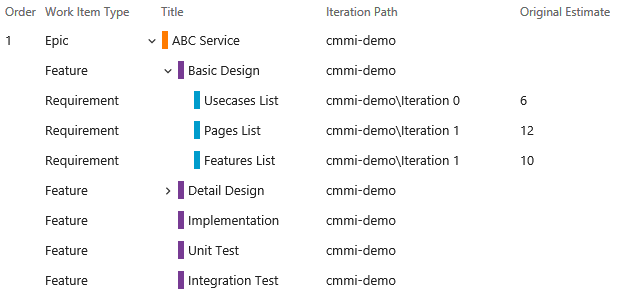
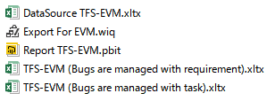
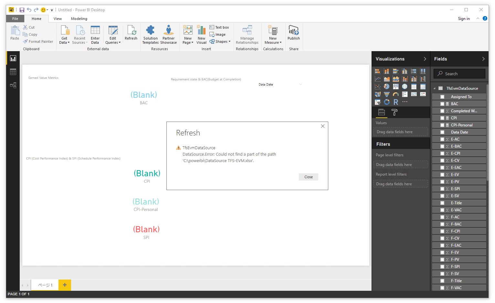
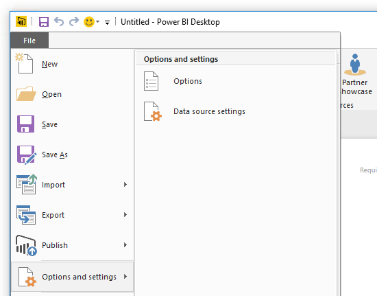
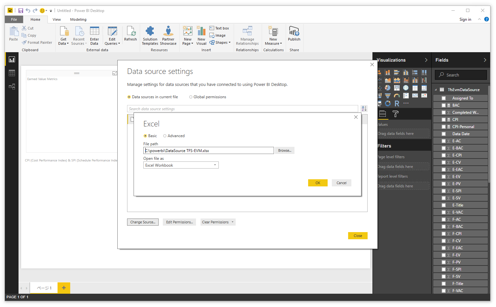
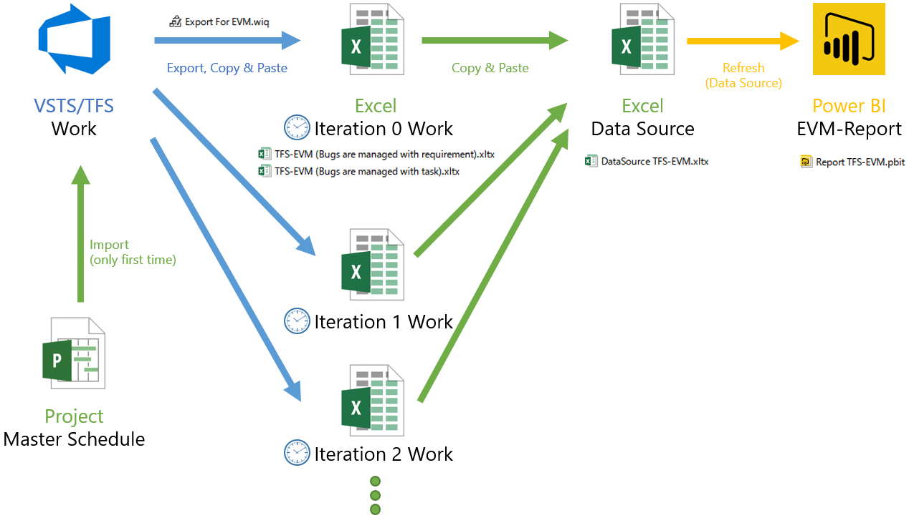
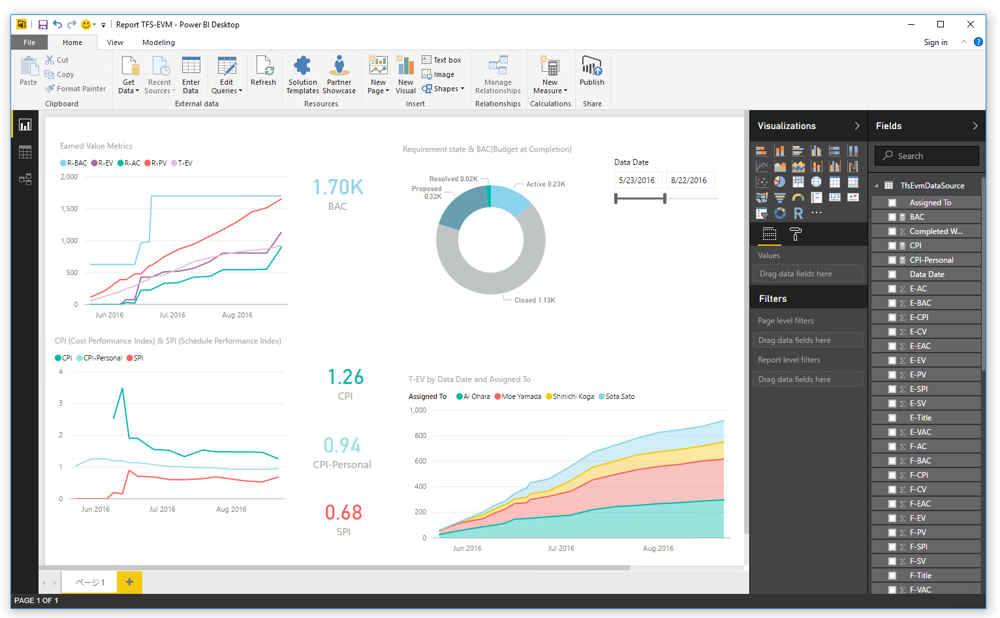

# How To Use
## Premise
 - Visual Studio Team Services(VSTS) Work items are input as  Epic-Feature-Requirement(Backlog). Import these three tiers from Microsoft Project if necessary. Iteration path for each Requirement (backlog) is set.
 
 
  - In this asset of Power BI and Excel, Calculate EVM by comparing Requirement(Backlog) and Task.
 - **Original Estimate** of Requirement(Backlog) is set.
 - Team member can add task as child of Requirement(Backlog). They set **Original Estimate**, **Remaining Work** and **Completed work**.  If you do work you will reduce **Remaining Work**. Also increase **Completed work**.
  - Change the **State** of task and Requirement(Backlog) to **Closed**.
  - The report is intended to be created for each iteration period. The SPI and the PV are not correct when making it on the way.

## First Preparation

1. Download all files of this asset. 
1. Copy **.xltb** files to your Office Template folder of My Documents (Optional)
1. Open **.wiq** file via text editor. Replace "AccountName" to your VSTS account name and replace "ProjectName" to your VSTS project name.
1. Open **.wiq** file via Visual Studio. Save it as shared query of VSTS.
1. Create a new Excel file via **DataSource TFS-EVM.xltx** and save to your folder. It is better not to change this folder until the end of the project.
1. Create a new Power BI file via **Report TFS-EVM.pbit**

Error will be occurred.
1.  Open **File** > **Options and settings** > **Data source settings**

1.  Change the path of Data Source to the file that just was created.

## Do per Iteration

1. Create a new Excel file via **TFS-EVM (Bugs are managed with task).xltx** or **TFS-EVM (Bugs are managed with requirement).xltx** and save to your folder. 
1. Open the Excel file and input **1.2. Iteration Data** work sheet. Change ＊＊Spent** of the past iteration  to **TRUE**.
1. Open the query via Visual Studio. Export Work items of VSTS to Excel file by using **Open by Excel**  command.
1. Copy table data of the Excel file.
1. Paste it to **3. Exported TFS・VSTS Data** work sheet of the Itearation Excel file. The hierarchy of exported work items may not go well. In that case, please give feedback.
1. Change **Data Date** of all rows.
1. Select all of table data and copy it.
1. Open the Data Source Excel file and paste Iteration data to the end of the file as text. If the expression remains, the report is incorrect.
1. Open the Power BI file and refresh.

SPI and CPI are not displayed correctly until you accumulate data.
These are displayed when the requirement will be completed.

